# Elite Kahoya Brothers - Architecture Diagram

## System Overview

This is a **TanStack Start** application for managing a savings and loans chama (investment group) called "Elite Kahoya Brothers".

```mermaid
graph TB
    subgraph "Client Layer"
        Browser[Browser]
    end
    
    subgraph "Server Entry"
        Server[server.ts]
        Start[start.ts]
    end
    
    subgraph "Routing Layer"
        Router[router.tsx]
        RouteTree[routeTree.gen.ts]
    end
    
    subgraph "Authentication"
        AuthContext[auth-context.tsx]
        SupabaseClient[Supabase Client]
        AuthMiddleware[auth-middleware.ts]
        AuthAttacher[auth-attacher.ts]
    end
    
    subgraph "Protected Routes"
        AuthLayout[_authenticated.tsx]
        PublicRoutes[Public Routes]
        Dashboard[dashboard.tsx]
        Members[members.tsx]
        Loans[loans.tsx]
        Savings[savings.tsx]
        Reports[reports.tsx]
        Passbooks[passbooks.tsx]
    end
    
    subgraph "Business Logic"
        LoanFunctions[loan.functions.ts]
        MemberFunctions[members.functions.ts]
        PassbookFunctions[passbook.functions.ts]
        OpeningBalances[opening-balances.functions.ts]
        SystemFunctions[system.functions.ts]
    end
    
    subgraph "Data Layer"
        SupabaseAdmin[Supabase Admin Client]
        Types[types.ts]
    end
    
    subgraph "Database - Supabase PostgreSQL"
        Profiles[profiles]
        UserRoles[user_roles]
        Loans[loans]
        LoanSchedule[loan_schedule]
        LoanRepayments[loan_repayments]
        Savings[savings]
        Collections[collections]
        Attendance[attendance_sheets, attendance_entries]
        Benevolent[benevolent_fund]
        Announcements[announcements]
        AuditLogs[audit_logs]
        SystemSettings[system_settings]
    end
    
    subgraph "UI Components"
        UIComponents[ui/ - Radix Components]
        PageHeader[PageHeader.tsx]
        PassbookTable[PassbookTable.tsx]
    end
    
    Browser -->|HTTP Request| Server
    Server --> Start
    Start -->|Middleware| AuthAttacher
    Start -->|Error Handling| Router
    Router --> RouteTree
    RouteTree --> AuthLayout
    
    AuthLayout --> AuthContext
    AuthContext --> SupabaseClient
    AuthContext -->|Role Check| AuthMiddleware
    
    AuthLayout --> PublicRoutes
    AuthLayout -->|Protected| Dashboard
    AuthLayout -->|Protected| Members
    AuthLayout -->|Protected| Loans
    AuthLayout -->|Protected| Savings
    AuthLayout -->|Protected| Reports
    AuthLayout -->|Protected| Passbooks
    
    Dashboard --> LoanFunctions
    Members --> MemberFunctions
    Loans --> LoanFunctions
    Savings --> MemberFunctions
    Reports --> PassbookFunctions
    Passbooks --> PassbookFunctions
    
    LoanFunctions --> SupabaseAdmin
    MemberFunctions --> SupabaseAdmin
    PassbookFunctions --> SupabaseAdmin
    OpeningBalances --> SupabaseAdmin
    SystemFunctions --> SupabaseAdmin
    
    SupabaseAdmin --> Types
    SupabaseAdmin --> Profiles
    SupabaseAdmin --> UserRoles
    SupabaseAdmin --> Loans
    SupabaseAdmin --> LoanSchedule
    SupabaseAdmin --> LoanRepayments
    SupabaseAdmin --> Savings
    SupabaseAdmin --> Collections
    SupabaseAdmin --> Attendance
    SupabaseAdmin --> Benevolent
    SupabaseAdmin --> Announcements
    SupabaseAdmin --> AuditLogs
    SupabaseAdmin --> SystemSettings
    
    Dashboard --> UIComponents
    Members --> UIComponents
    Loans --> UIComponents
    Passbooks --> PassbookTable
```

## Technology Stack

### Frontend Framework
- **TanStack Start**: React SSR framework with file-based routing
- **React 19**: UI library
- **TanStack Router**: File-based routing with type safety
- **TanStack Query**: Data fetching and caching

### UI/Styling
- **TailwindCSS v4**: Utility-first CSS
- **Radix UI**: Headless UI components
- **Lucide React**: Icon library
- **shadcn/ui**: Component library built on Radix UI

### Backend/Database
- **Supabase**: PostgreSQL database with auth
- **Supabase Auth**: Authentication and user management
- **PostgreSQL**: Relational database

### Build Tools
- **Vite**: Build tool and dev server
- **Bun**: Package manager and runtime
- **TypeScript**: Type-safe JavaScript

### Additional Libraries
- **React Hook Form**: Form management
- **Zod**: Schema validation
- **jsPDF**: PDF generation for passbooks
- **Recharts**: Data visualization
- **date-fns**: Date manipulation

## Architecture Layers

### 1. Entry Point Layer
- `server.ts`: Cloudflare Workers entry point with error handling
- `start.ts`: TanStack Start configuration with middleware
- `router.tsx`: Router setup with QueryClient context

### 2. Authentication Layer
- `auth-context.tsx`: React context for auth state (user, session, profile, role)
- `auth-middleware.ts`: Server-side auth validation
- `auth-attacher.ts`: Attaches auth to server functions
- `session-storage-shim.ts`: Session storage compatibility

**Roles**: super_admin, admin, auditor, member

### 3. Routing Layer
- `__root.tsx`: Root layout with providers (QueryClient, AuthProvider, Toaster)
- `_authenticated.tsx`: Protected route layout with role-based navigation
- Public routes: login, forgot-password, reset-password, change-password
- Authenticated routes: dashboard, members, loans, savings, reports, etc.

### 4. Business Logic Layer
Server functions (`createServerFn`) for:
- **Loan Management**: `loan.functions.ts` - loan creation, repayment calculation, fine calculation
- **Member Management**: `members.functions.ts` - CRUD operations, role assignment
- **Passbook**: `passbook.functions.ts` - PDF generation, transaction history
- **Opening Balances**: `opening-balances.functions.ts` - initial balance setup
- **System**: `system.functions.ts` - system settings, reset operations

### 5. Data Layer
- `types.ts`: Auto-generated TypeScript types from Supabase schema
- `client.ts`: Supabase client for browser
- `client.server.ts`: Supabase admin client for server (bypasses RLS)

### 6. Database Schema
**Core Tables**:
- `profiles`: Member information
- `user_roles`: Role assignments
- `loans`: Loan records
- `loan_schedule`: Repayment schedule
- `loan_repayments`: Payment history
- `savings`: Member savings
- `collections`: Weekly collections
- `attendance_sheets` & `attendance_entries`: Meeting attendance
- `benevolent_fund`: Welfare fund records
- `announcements`: System announcements
- `audit_logs`: Change tracking
- `system_settings`: Configuration

## Data Flow

### Authentication Flow
1. User logs in via `/login`
2. Supabase Auth validates credentials
3. Session stored in Supabase
4. `auth-context.tsx` loads user profile and role from `profiles` and `user_roles` tables
5. Role determines available navigation items in `_authenticated.tsx`

### Protected Route Access
1. User navigates to protected route
2. `_authenticated.tsx` checks auth state
3. If not authenticated, redirects to `/login`
4. If authenticated but must change password, redirects to `/change-password`
5. If no role assigned, shows error
6. Role-based navigation items displayed

### Server Function Execution
1. UI component calls server function (e.g., `adminCreateMember`)
2. `requireSupabaseAuth` middleware validates session
3. Role assertion checks permissions (e.g., `assertCaller`)
4. Business logic executes with admin client
5. Audit log entry created for tracking
6. Response returned to client

### Loan Calculation Flow
1. Loan created with principal, interest rate, duration
2. `loan.functions.ts` generates repayment schedule
3. Each payment period has expected amount
4. Payments recorded in `loan_repayments`
5. Late payments trigger fines in `loan_fines`
6. `recalculateLoan` function recalculates status after changes

## Key Features by Role

### Super Admin
- Full access to all features
- Member management with role assignment
- System reset (development mode only)
- Opening balances management
- Audit log access

### Admin
- Member management (except role assignment)
- Loan management
- Savings and collections
- Attendance tracking
- Reports generation
- Benevolent fund management

### Auditor
- Read-only access to passbooks
- Reports viewing
- Audit log access
- Dashboard overview

### Member
- Personal passbook view
- Personal loan status
- Personal savings
- Personal benevolent fund contributions
- Personal attendance
- Announcements

## Security Model

1. **Authentication**: Supabase Auth with JWT tokens
2. **Authorization**: Role-based access control (RBAC)
3. **Row Level Security**: Supabase RLS policies on database
4. **Server Functions**: Protected by auth middleware and role assertions
5. **Audit Logging**: All critical changes logged to `audit_logs`
6. **Password Policy**: Forced password change on first login
